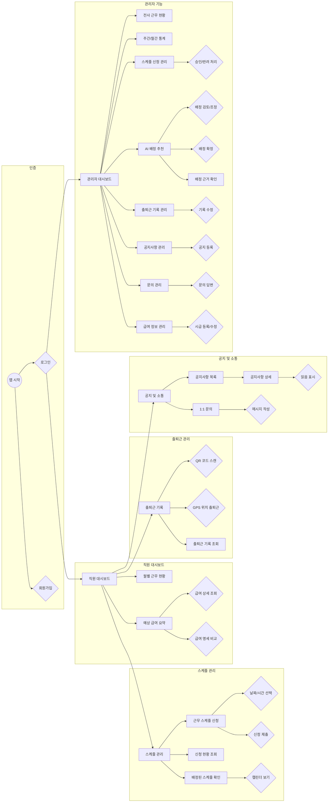

```mermaid
flowchart LR

  subgraph s1 ["인증"]
    n1(("앱 시작"))
    n2{"로그인"}
    n3{"회원가입"}
  end

  subgraph s2 ["직원 대시보드"]
    n4["직원 대시보드"]
    n5["월별 근무 현황"]
    n6["예상 급여 요약"]
    n7{"급여 상세 조회"}
    n8{"급여 명세 비교"}
  end

  subgraph s3 ["스케줄 관리"]
    n9["스케줄 관리"]
    n10["근무 스케줄 신청"]
    n11{"날짜/시간 선택"}
    n12{"신청 제출"}
    n13["신청 현황 조회"]
    n14["배정된 스케줄 확인"]
    n15{"캘린더 보기"}
  end

  subgraph s4 ["출퇴근 관리"]
    n16["출퇴근 기록"]
    n17{"QR 코드 스캔"}
    n18{"GPS 위치 출퇴근"}
    n19["출퇴근 기록 조회"]
  end

  subgraph s5 ["공지 및 소통"]
    n20["공지 및 소통"]
    n21["공지사항 목록"]
    n22["공지사항 상세"]
    n23{"읽음 표시"}
    n24["1:1 문의"]
    n25{"메시지 작성"}
  end

  subgraph s6 ["관리자 기능"]
    n26["관리자 대시보드"]
    n27["전사 근무 현황"]
    n28["주간/월간 통계"]
    n29["스케줄 신청 관리"]
    n30{"승인/반려 처리"}
    n31["AI 배정 추천"]
    n32{"배정 검토/조정"}
    n33{"배정 확정"}
    n34["배정 근거 확인"]
    n35["출퇴근 기록 관리"]
    n36{"기록 수정"}
    n37["공지사항 관리"]
    n38{"공지 등록"}
    n39["문의 관리"]
    n40{"문의 답변"}
    n41["급여 정보 관리"]
    n42{"시급 등록/수정"}
  end

  n1 --> n2
  n1 --> n3
  n2 --> n4
  n2 --> n26
  n4 --> n5
  n4 --> n6
  n6 --> n7
  n6 --> n8
  n4 --> n9
  n9 --> n10
  n10 --> n11
  n10 --> n12
  n9 --> n13
  n9 --> n14
  n14 --> n15
  n4 --> n16
  n16 --> n17
  n16 --> n18
  n16 --> n19
  n4 --> n20
  n20 --> n21
  n21 --> n22
  n22 --> n23
  n20 --> n24
  n24 --> n25
  n26 --> n27
  n26 --> n28
  n26 --> n29
  n29 --> n30
  n26 --> n31
  n31 --> n32
  n31 --> n33
  n31 --> n34
  n26 --> n35
  n35 --> n36
  n26 --> n37
  n37 --> n38
  n26 --> n39
  n39 --> n40
  n26 --> n41
  n41 --> n42
```
